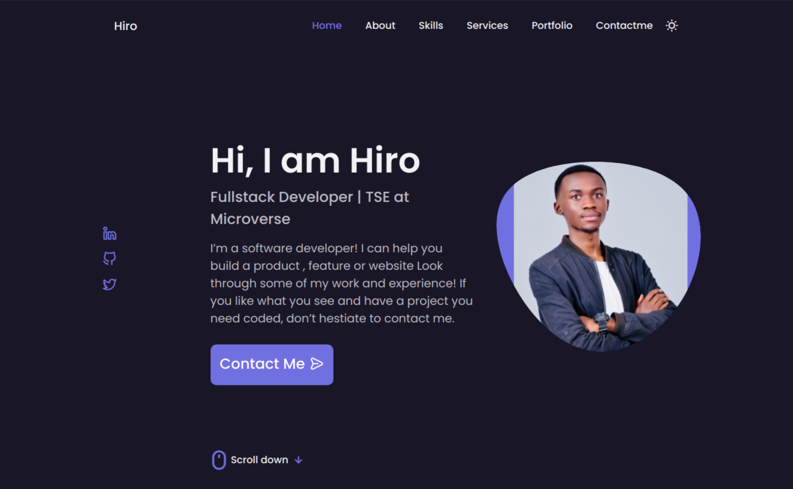

<h1 align="center">Hi , I'm Aganze Mataba</h1>

<h3 align="center">Software Engineer</h3>

  <em>
    <b>Software Developer</b>  and a <b>Addicted to Programming</b>&nbsp;&nbsp, always <b>
ready for</b>
     new challenges to 
    <b>grow</b> and 
    <b>excel</b> &nbsp.
  </em> 
   
  

 
  
  
<h2> What I currently do</h2>

- 👯 I’m looking to collaborate on Full-stack-Web application and IoT projects.
- 🤔 I’m looking for new opportunities.
- 💬 Ask me about Javascript,Ruby, Full-stack Web Development, Any tech-related stuff.
  
   

  
  💻 **Languages and Tools:** 🛠️ 

 

  
  

  
 
&nbsp;
  

  

